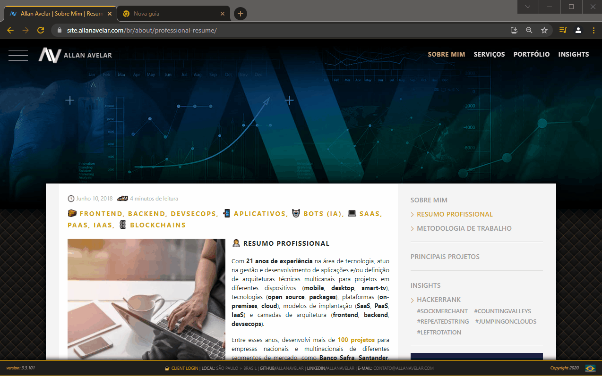

  <a href="https://github.com/allanavelar/chrometheme">
    
    <h1 align="center">Dark Gold ▲▼ Google Chrome Theme</h1>
  </a>

  
  
  
  <h3 align="center">This theme is based on my website colors.</h3>

## Screenshots

### With currently over and active tab highlight:

## Author

 |
--- |
[▲▼ Allan Avelar ۞](https://github.com/allanavelar)|

## Copyright and license

Code and documentation copyright 2017-2018.

Code released under the [MIT License](./LICENSE).

Enjoy 🤘